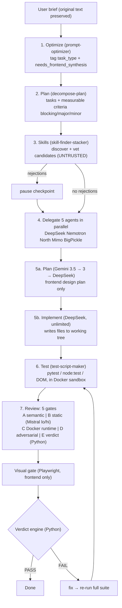

# opencode-moa — moa-v2

An **evidence-based build pipeline** for [opencode](https://opencode.ai). moa-v2 orchestrates 10 sub-agents to build complete deliverables (web / app / analysis) in the current working directory and proves correctness through a deterministic, 5-gate review pipeline.

> **Core invariant:** no model opinion can issue PASS. PASS is the output of the Python verdict engine (`verdict_engine.py`) applied to typed evidence bound to a hashed revision.

## How it works



## Team

| Agent | Model | Role |
|---|---|---|
| @moa-v2 | opencode/deepseek-v4-flash-free | Orchestrator (primary) |
| @moa-deepseek | opencode/deepseek-v4-flash-free | Reasoning, plan synthesis, implementation (writes files) |
| @moa-nemotron | opencode/nemotron-3-ultra-free | Analysis, edge cases, optimization |
| @moa-north | opencode/mimo-v2.5-free | Code structure analysis & review |
| @moa-mimo | opencode/mimo-v2.5-free | Programming & implementation |
| @moa-bigpickle | opencode/big-pickle | Creative direction & brainstorming |
| @moa-gemini35 | google/gemini-3.5-flash | Frontend/UI/UX plan (primary, plan only) |
| @moa-gemini3 | google/gemini-3-flash | Frontend/UI/UX plan (fallback, plan only) |
| @moa-mistral-reviewer | mistral/mistral-small-2603 | Gate A + E1 + structure passes (lo tier) |
| @moa-mistral-reviewer-hi | mistral/mistral-medium-2604 | Gate B module/security passes (hi tier) |
| @moa-runtime-verifier | script (no LLM) | Gate C Docker runtime execution |

## Five-Gate Review

Gate models never write to the working tree (`edit: deny`).

- **Gate A (semantic coverage)** — @moa-mistral-reviewer. Did the criteria drop/weaken any explicit or implicit requirement in the original text?
- **Gate B (static, staged)** — structure pass (lo) then module/security passes (hi). Operates on the hashed tree.
- **Gate C (runtime)** — @moa-runtime-verifier runs commands only inside a Docker sandbox: copy-in, no network, read-only fs, env scrubbed, resource limits, non-root, teardown.
- **Gate D (adversarial)** — isolated @moa-deepseek writes negative/boundary tests before reading existing tests; mutation tests on a COW snapshot.
- **Gate E (verdict)** — E1 normalizes all reports into one JSON (evidence references artifact IDs only); E2 runs `verdict_engine.py` locally (no LLM). The model writes a summary only; it cannot override the verdict.

For **frontend / complex** tasks a **visual gate** runs via Playwright MCP: screenshots at 375x812, 768x1024, 1440x900 + interactive states, plus programmatic checks. DOM tests alone never grant frontend PASS.

## Requirements

- [opencode](https://opencode.ai)
- Python 3.14+ (for the verdict engine, unit tests, and sandbox runner)
- Docker Desktop with WSL2 backend (Gate C + mutation isolation)
- Playwright browsers (visual gate): `npx playwright install`

## Install

1. **Copy the agents** into your opencode config:

   ```powershell
   Copy-Item -Recurse agents\* ~\.config\opencode\agents\
   ```

2. **Copy the skill family**:

   ```powershell
   Copy-Item -Recurse skills\moa-v2 ~\.config\opencode\skills\
   ```

3. **Merge the config** — take `config/opencode.jsonc.example` and merge the `provider.mistral` block plus the `moa-*` agent definitions into your existing `opencode.jsonc`.

4. **API keys** (all via env vars — no literals in the repo):

   - `MISTRAL_API_KEY` — reviewer backend ([Mistral console](https://console.mistral.ai/), free Experiment tier, no credit card):
     ```powershell
     [System.Environment]::SetEnvironmentVariable('MISTRAL_API_KEY', 'YOUR-KEY', 'User')
     ```
   - `GOOGLE_API_KEY` / Gemini — for the @moa-gemini35/3 plan authors (free tier, ~1400 RPD).
   - opencode Zen / DeepSeek — for the orchestrator, @moa-deepseek, and the 5 parallel agents.

5. **Restart opencode** so the `{env:MISTRAL_API_KEY}` reference resolves.

## Usage

Invoke the `@moa-v2` agent with your brief. Auto-mode is the default (states assumptions and proceeds); interactive checkpoints exist for skill rejections, destructive commands, out-of-reach complexity, and context pressure.

## Rate limits & quota

- **Mistral free tier:** 50 RPM / 50K TPM per model (measured), ~1B tokens/month, resets monthly. Each reviewer pass must stay a single API call — the orchestrator pre-feeds file contents inline; batch-read via `Get-Content -Raw a,b,c` only when content was not supplied inline. On 429: `Start-Sleep -Seconds 5` then retry.
- **Gemini:** ~1400 RPD / ~10 RPM per model → **plan authoring only**; implementation always goes to @moa-deepseek (unlimited).
- **Fail-closed:** a missing required gate → `INCOMPLETE_REVIEW`, never PASS. If Mistral is down and the fallback reviewer is not benchmark-passed → `INCOMPLETE_REVIEW`, never a silent swap.

## Verification

```powershell
cd skills\moa-v2\scripts
powershell -File .\test_moa_v2.ps1        # Gate 1
powershell -File .\gate2_dry_run.ps1      # Gate 2 (providers + Docker)
python -m pytest -q                        # unit tests (61 tests)
```

## Layout

```
agents/                      9 agent definitions (moa-v2 + team)
skills/moa-v2/               skill family
  prompt-optimizer/          Step 1 — brief + task_type tags
  decompose-plan/            Step 2 — tasks + measurable criteria
  skill-finder-stacker/      Step 3 — skill discovery + vetting
  test-script-maker/         Step 6 — test matrix + scripts
  scripts/                   root-of-trust Python + PS1 scripts
    verdict_engine.py        authoritative verdict (no LLM)
    build_review_package.py  build the typed review package
    classify_complexity.py   complexity scaling
    mutate_workspace.py      COW mutation tests
    benchmark_reviewer.py    fallback-reviewer benchmark
    sandbox/                 Docker sandbox (Gate C)
  MOA_V2_MEMORY.md           budget counters + benchmark table
  LESSONS.md                 append-only lessons
config/opencode.jsonc.example  trimmed provider + agent config
```
